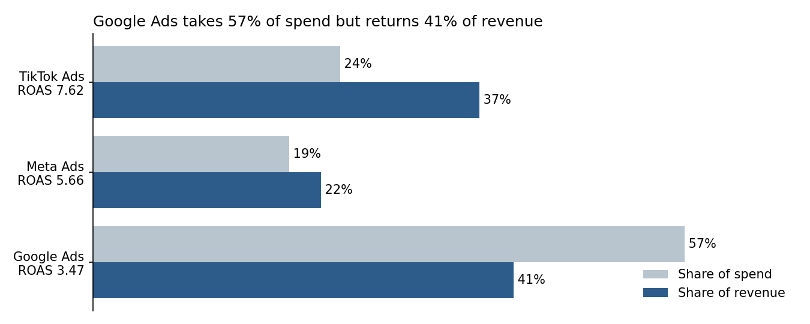
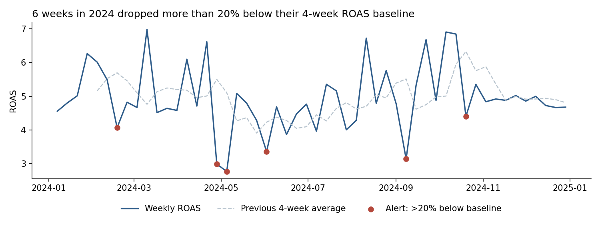

# Cross-Platform Ads Performance: Google vs. Meta vs. TikTok

**Business question:** Across Google, Meta and TikTok ads in 2024, which platforms and campaign types return the most revenue per dollar, where should budget move, and which weeks need attention?

> **Note:** the dataset is **simulated** (per its Kaggle description) with realistic relationships between impressions, clicks, spend, conversions and revenue. The findings demonstrate the analysis and reporting method, not real platform performance.

## Key Findings

1. **Google Ads is over-funded relative to its return.** It takes 57% of spend but returns 41% of revenue, at ROAS 3.47, versus 7.62 for TikTok and 5.66 for Meta.
2. **TikTok leads at both funnel steps:** the highest CTR (5.5%) and the highest conversion rate, giving the lowest CPA (21.67 vs. 48.43 on Google).
3. **Platform matters more than campaign type:** every TikTok campaign type beats every Google campaign type on ROAS.
4. **Reallocation scenario:** moving 20% of Google spend to TikTok would add about 5.3M revenue (+9.7%) at the same total spend, assuming ROAS holds. This is an upper estimate; validate with a gradual shift.
5. **Loss-making spend:** 7.5% of campaign-days had ROAS below 1 (10.8% of spend); 92 of those 135 were on Google.
6. **Reporting accuracy:** averaging row-level ROAS gives 6.45, but true ROAS (total revenue ÷ total spend) is 4.88. The simple average overstates performance by 32%, so all ratios here are calculated from totals.

---

## ROAS by Platform and Campaign Type

| Platform | Display | Search | Shopping | Video |
|---|---|---|---|---|
| TikTok Ads | 8.01 | 8.12 | 6.85 | 7.56 |
| Meta Ads | 5.82 | 5.77 | 5.54 | 5.51 |
| Google Ads | 3.16 | 3.92 | 3.23 | 3.53 |

## Weekly Monitoring

Each week's ROAS is compared with its previous 4-week average; a week more than 20% below baseline is flagged. Six weeks were flagged in 2024. In a live account, each alert would trigger a drill-down by platform, campaign type and country. In simulated data some swings are random noise, so the alerts show the monitoring method.

---

## Data Checks

| Check | Result |
|---|---|
| Missing values, duplicate rows | 0 |
| Clicks > impressions, conversions > clicks | 0 |
| Pre-computed CTR / CPC / CPA / ROAS vs. raw columns | All consistent |

## Data

- **Source:** [Global Ads Performance: Google, Meta, TikTok (Kaggle)](https://www.kaggle.com/datasets/nudratabbas/global-ads-performance-google-meta-tiktok)
- **Size:** 1,800 campaign-day records, Jan 1–Dec 30, 2024
- **Dimensions:** platform (3), campaign type (4), industry (5), country (7)
- **Measures:** impressions, clicks, spend, conversions, revenue

## Limitations

- Simulated data: results show the method, not real market performance.
- No budget column, so pacing against plan is not possible; the weekly monitor uses each week's own recent baseline instead.
- Currency and revenue attribution rules are not documented.
- The reallocation scenario assumes constant ROAS; real campaigns show diminishing returns.

## Files

| File | Description |
|---|---|
| `Cross_Platform_Ads_Performance.ipynb` | Data checks, KPIs, platform and campaign-type comparison, reallocation scenario, weekly monitor |
| `global_ads_performance_dataset.csv` | Raw dataset (1,800 rows) |
| `ads_performance_for_tableau.csv` | Same data with `week_start` and `month` columns for Tableau |
| `images/` | Charts exported from the notebook |

## Tools
Python (pandas, NumPy, matplotlib)
