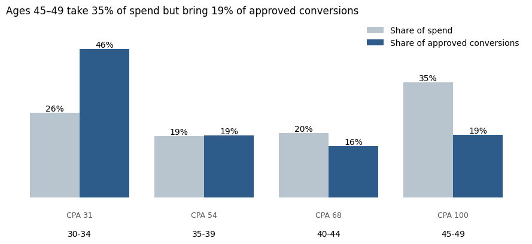

# Facebook Ad Campaign Performance & Budget Reallocation

**Business question:** Across three Facebook ad campaigns, which audiences convert most cost-effectively, and where should budget move to get more approved conversions for the same spend?

## Key Findings

1. **Ages 30–34 are the most efficient audience.** Cost per approved conversion (CPA) is about 31 for ages 30–34, versus about 100 for ages 45–49. The 45–49 group takes 35% of spend but brings only 19% of approved conversions.
2. **Higher CTR did not mean cheaper conversions.** Women clicked more often (CTR 0.021% vs. 0.014%), but men converted more cheaply (CPA about 41 vs. 70).
3. **Reallocation scenario:** moving 25% of the 45–49 budget to 30–34 would add about 116 approved conversions (+11%) at the same total spend, assuming CPA holds. This should be validated with a small test before scaling.
4. **Monitoring gap:** 25% of spend went to ads with zero approved conversions. A rule that flags ads past a spend threshold with no approvals would catch these earlier.

---

## Metrics

| Metric | Formula | Overall |
|---|---|---|
| CTR | clicks ÷ impressions | 0.018% |
| CPC | spend ÷ clicks | 1.54 |
| CPM | spend ÷ impressions × 1,000 | 0.28 |
| Approval rate | approved ÷ total conversions | 33% |
| **CPA** | spend ÷ approved conversions | **54.41** |

The dataset has no revenue column, so ROAS cannot be calculated; CPA is the main efficiency metric.

## Campaign Comparison

| Campaign | Ads | Spend share | Approved-conversion share | CPA |
|---|---|---|---|---|
| 1178 | 625 | 95% | 81% | 63.83 |
| 936 | 464 | 5% | 17% | 15.81 |
| 916 | 54 | 0.3% | 2% | 6.24 |

Campaign 1178 dominates spend at a much higher CPA, but the smaller campaigns spent far less, so their CPAs may not hold at scale. The audience analysis compares segments inside the same campaigns instead.

---

## Data Checks

| Check | Result |
|---|---|
| Missing values, duplicate rows, duplicate ad IDs | 0 |
| Clicks > impressions, approved > total conversions | 0 |
| Ads with impressions but 0 clicks and 0 spend | **207 (204 still record conversions)** |

The 0-click, 0-spend conversions are most likely view-through attribution (credited after someone only saw the ad), but the dataset does not document this. They were kept, because they do not affect spend-based metrics; in a real campaign, this would be confirmed with the campaign team before reporting.

## Data

- **Source:** [Sales Conversion Optimization (Kaggle)](https://www.kaggle.com/datasets/loveall/clicks-conversion-tracking)
- **Size:** 1,143 ads across 3 campaigns; columns include age group, gender, interest code, impressions, clicks, spend, total conversions and approved conversions

## Limitations

- No dates, so trends and budget pacing cannot be analyzed.
- No revenue, so ROAS cannot be calculated.
- The currency of spend is not stated.
- The reallocation scenario assumes CPA stays constant; in practice CPA usually rises as more budget goes into one audience, so +11% is an upper estimate.

## Files

| File | Description |
|---|---|
| `Facebook_Ad_Campaign_Analysis.ipynb` | Data checks, KPI calculations, campaign and audience comparison, reallocation scenario |
| `KAG_conversion_data.csv` | Raw dataset (1,143 ads) |
| `images/` | Charts exported from the notebook |

## Tools
Python (pandas, NumPy, matplotlib)
