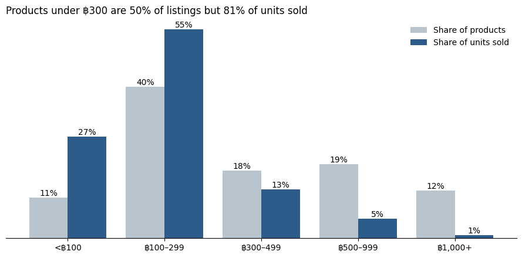

# Lazada Thailand Health & Wellness Products Analysis

**Business question:** If you were selling health and wellness products on Lazada Thailand, which categories and price points move the most volume, and where are the successful sellers based?

**▶ [Open the interactive Tableau dashboard](https://public.tableau.com/views/LazadaThailandHealthProductsDashboard/LazadaDashboard)**

---

## Key Findings

1. **Low prices drive volume.** Products under ฿300 are 50% of listings but 81% of units sold. Products above ฿1,000 are 12% of listings but only 1% of units.
2. **Protein is the biggest category**, leading on units sold and making up 23% of estimated revenue. Fat Blockers & Burners and Whitening follow on units.
3. **Sellers cluster in Greater Bangkok**, which ships 72% of all units. Khon Kaen ranks #2, but 70% of its volume comes from one brand's two protein products.
4. **Reviews are a reliable proxy for sales** (Spearman correlation 0.96). That matters because 46% of listings show no sales counter.

---

## Data Quality Issues I Found and Fixed

My first version of this analysis reported the wrong best-selling categories. Two problems in the raw data caused it:

| Issue | What went wrong | Fix |
|---|---|---|
| **Duplicate listings** | The 68,499 scraped rows contain only 2,497 unique products; each was captured 27 times on average (up to 115). Every total was inflated. | Kept one row per product: the snapshot with the highest cumulative sales. |
| **Number parsing bug** | Sales are stored as Thai text such as `5,786 ชิ้น`. A regex that took the first run of digits stopped at the comma, so 5,786 became 5 and `9,999+` became 9. Top sellers were undercounted the most. | Removed thousands separators, handled `k`, and flagged `9,999+` / `100k+` as lower bounds. Missing values stay missing, not 0. |

After the fixes, the top categories changed from Skin Nourishment and Multivitamins to **Protein, Fat Blockers & Burners and Whitening**.

---

## Dashboard

Built in Tableau Public from `lazada_health_products_clean.csv`:

- **KPIs:** 2,497 products · 1.91M units sold · ฿404.1M estimated revenue · ฿299 median price
- **Category ranking:** top 10 categories by units sold, colored by estimated revenue
- **Price band share:** share of products vs. share of units sold in each price band
- **Seller location:** top 10 seller provinces, Greater Bangkok vs. other provinces
- **Filter:** Region Group, applied to every chart

---

## Data

- **Source:** [Kaggle – Lazada Thailand Health Products](https://www.kaggle.com/datasets/wuttipats/lazada-thailand-health-products-dataset): product name, category (30 health categories), price, units sold, reviews, and seller province
- **Grain after cleaning:** one row per product
- `Shop Location` is the **seller's** province, not the buyer's

## Limitations

- Units sold are cumulative lifetime counts with no dates, so this shows which products have sold the most, not current trends.
- 52 products display only `9,999+` or `100k+`, so all totals are lower bounds.
- Revenue is estimated as units sold × current price and ignores discounts and price changes.

---

## Files

| File | Description |
|---|---|
| `Lazada_Health_Product_Analysis.ipynb` | Data-quality checks, cleaning, and the analysis behind each dashboard chart |
| `health_and_wellness_cleaned.csv` | Raw scraped data (68,499 rows) |
| `lazada_health_products_clean.csv` | Cleaned data, one row per product (2,497 rows); the dashboard's data source |
| `images/` | Charts exported from the notebook |

## Tools
Python (pandas, NumPy, matplotlib) · Tableau Public
